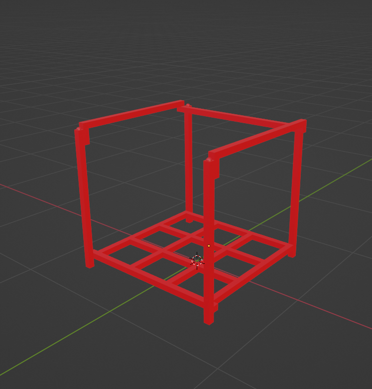
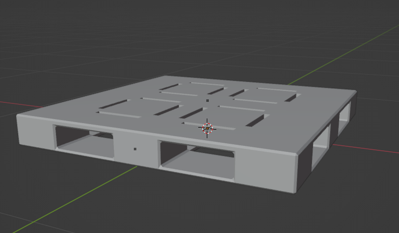
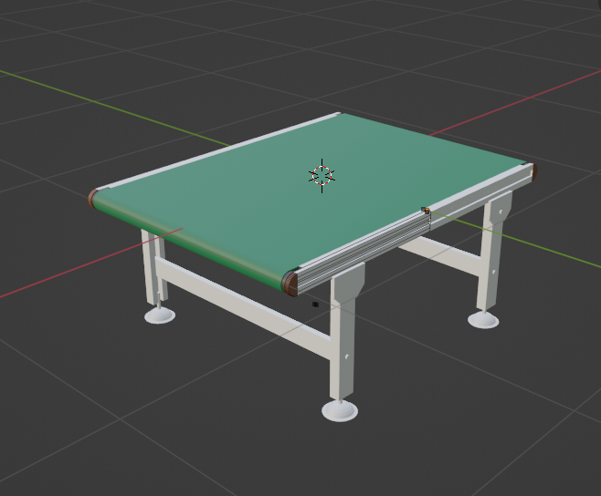
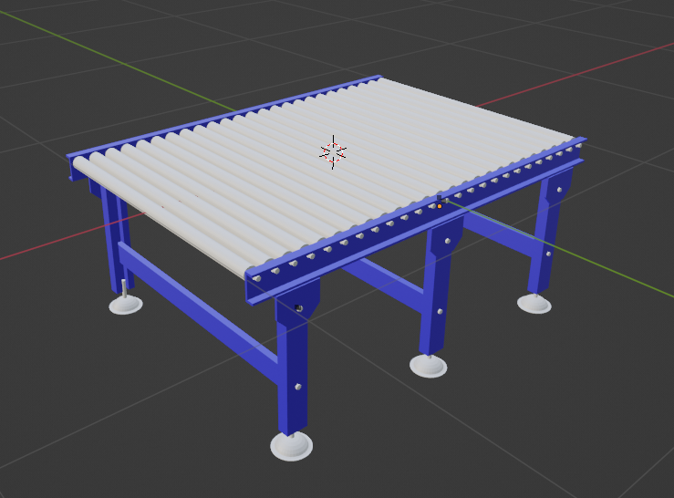
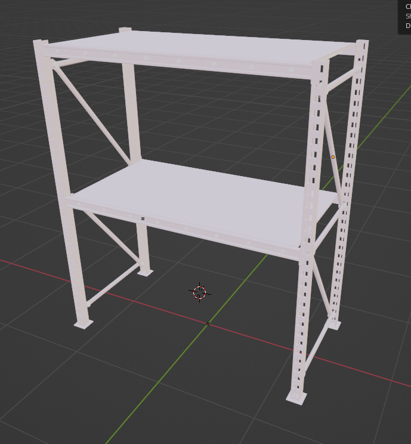

# Blender Models

Blender models for robotics simulations.

## FBX export example

```
cd tools
./export.sh --blender_path /Applications/Blender3.3.app/Contents/MacOS/Blender --src_blender_file ../conveyors/roller_conveyor.blend --target_fbx ../temp2.fbx
```

## Screen shots

**Nestainer**



**Pallet**



**BeltConveyor**



**RollerConveyor**



**Rack**



## Conatact

yuokamoto1988@gmail.com
